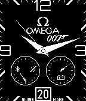
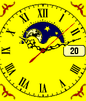
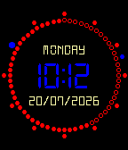

<div align="center">

# Pebblehertz

**Pebble Time watchfaces on the rear display of the Unihertz Titan 2.**

No root. Real PebbleOS. Native ARM64 QEMU.

[](https://github.com/manufact-test/Pebblehertz/releases/latest)
[](https://github.com/manufact-test/Pebblehertz)
[](https://github.com/manufact-test/Pebblehertz)
[](https://github.com/manufact-test/Pebblehertz)






[Download the latest beta](https://github.com/manufact-test/Pebblehertz/releases/latest) · [Roadmap](ROADMAP.md) · [Compatibility](COMPATIBILITY.md) · [Report a bug](https://github.com/manufact-test/Pebblehertz/issues/new?template=bug_report.yml)

</div>

## What is Pebblehertz?

Pebblehertz turns the Titan 2 rear screen into a tiny Pebble Time. The selected `.pbw` watchface runs inside real PebbleOS firmware through a native ARM64 QEMU runtime, while Android handles the watchface library, imports, previews and rear-display routing.

This is not a visual imitation. Pebblehertz boots the Basalt firmware, installs Pebble packages through the original Pebble protocols and displays the real `144 × 168` framebuffer.

## Current beta: 0.8.9

- 16 bundled Pebble Time watchfaces with real QEMU-rendered previews.
- Import and retain additional `.pbw` watchfaces.
- Switch faces without rebooting PebbleOS.
- Confirm the exact active Pebble UUID before showing `ACTIVE / ON AIR`.
- Duplicate import protection by Pebble UUID.
- Optional Wise and PayPal project support links.

See [`CHANGELOG_0.8.9.md`](CHANGELOG_0.8.9.md) for the release details.

## Install

1. Download `Pebblehertz-0.8.9.apk` from the [latest release](https://github.com/manufact-test/Pebblehertz/releases/latest).
2. Allow installation from the browser or file manager you used to download it.
3. Open Pebblehertz and grant the requested background-operation access.
4. In the Titan 2 secondary-screen settings, keep the rear display enabled as needed.
5. Exclude Pebblehertz from battery optimization, DuraSpeed restrictions and the Titan 2 App blocker.

> **Clean-install note:** if you tested Pebblehertz before **July 21, 2026**, uninstall that older build before installing 0.8.9. Future versions can be installed over 0.8.9 normally.

## Supported today

| Area | Current support |
|---|---|
| Phone | Unihertz Titan 2 |
| Pebble platform | Basalt / Pebble Time |
| Packages | Pebble Time watchfaces in `.pbw` format |
| Root access | Not required |
| Imported faces | Standalone faces work best |
| Other rear-screen phones | Not yet tested or supported |

Read [`COMPATIBILITY.md`](COMPATIBILITY.md) before reporting an imported face that needs phone-side JavaScript, configuration pages, weather or another online service.

## Known limitations

- Pebblehertz uses one continuous foreground runtime with automatic watchdog recovery. Android Force stop and the Titan 2 App blocker remain terminal system actions.
- PebbleKit JS, watchface configuration pages, network/weather bridges and phone notifications are not implemented yet.
- Health data such as steps and heart rate is not available yet.
- Pebble apps and games that depend on physical Pebble buttons are outside the current watchface-focused scope.

The next release focuses on one stable always-on runtime and removes experimental power modes. See the full [`ROADMAP.md`](ROADMAP.md).

## Roadmap at a glance

- **0.8.10 — Stability & Diagnostics:** one protected foreground runtime, watchdog recovery, diagnostic export and PBW capability labels.
- **0.9.0 — Personal Face:** use a photo or GIF with configurable digital time overlays.
- **0.10.0 — PebbleKit Compatibility:** JavaScript runtime, AppMessage, configuration pages and network/weather support.
- **0.11.0 — Phone Data:** Health Connect, selected notifications, music and calendar data.

Roadmap versions describe priorities rather than guaranteed dates.

## Reporting bugs

Use the [bug report form](https://github.com/manufact-test/Pebblehertz/issues/new?template=bug_report.yml) and include:

- Pebblehertz version;
- Titan 2 firmware / Android build;
- watchface name, source and UUID when available;
- exact reproduction steps;
- screenshot or short video;
- whether the problem appears after clearing recent apps, locking the phone, switching, importing or deleting a PBW.

## Build from source

Requirements:

- JDK 17
- Android SDK 36
- Android NDK 28
- CMake 3.22.1
- Gradle 9.5.0
- ARM64 Android target

```bash
python3 scripts/fetch_bundled_watchfaces.py
PEBBLE_SDK_VERSION=4.17 python3 scripts/fetch_pebble_basalt_firmware.py
gradle :app:testDebugUnitTest :app:assembleDebug
```

The debug APK is written to:

```text
app/build/outputs/apk/debug/app-debug.apk
```

Architecture notes are available in [`docs/architecture.md`](docs/architecture.md). Contributions are described in [`CONTRIBUTING.md`](CONTRIBUTING.md).

## Reproducible third-party assets

Bundled PBW source pages and pinned SHA-256 hashes are recorded in [`bundled-watchfaces.json`](bundled-watchfaces.json) and [`THIRD_PARTY_WATCHFACES.md`](THIRD_PARTY_WATCHFACES.md). Firmware and watchface fetch scripts verify pinned inputs before they are packaged.

## Support the project

Pebblehertz remains free. Support is optional and helps fund testing devices and future rear-screen ports.

- [Wise](https://wise.com/pay/me/ilyas709)
- [PayPal](https://www.paypal.me/myarrogantfox)

## Disclaimer

Pebblehertz is an independent community project and is not affiliated with Unihertz, Pebble, Google or the original watchface authors. Third-party names and trademarks belong to their respective owners.
